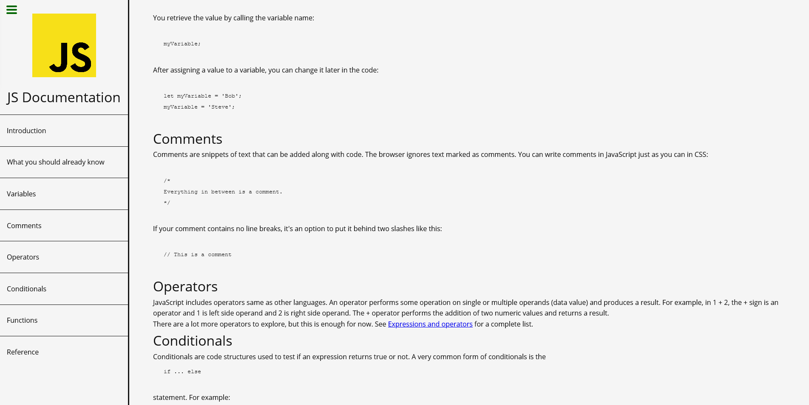

# FreeCodeCamp Technical Documentation Page

A responsive technical documentation page of Javascript. This page was built as a front-end project of the [FreeCodeCamp](https://www.freecodecamp.org/learn/responsive-web-design/responsive-web-design-projects/build-a-technical-documentation-page)

- [Page](https://norwyx.github.io/FCC-Technical-Documentation-Page/) - Final result of the project

## Built with
- [HTML5](https://developer.mozilla.org/es/docs/HTML/HTML5)
- [CSS3](https://developer.mozilla.org/es/docs/Web/CSS/CSS3)
- [Github Pages](https://pages.github.com/)
